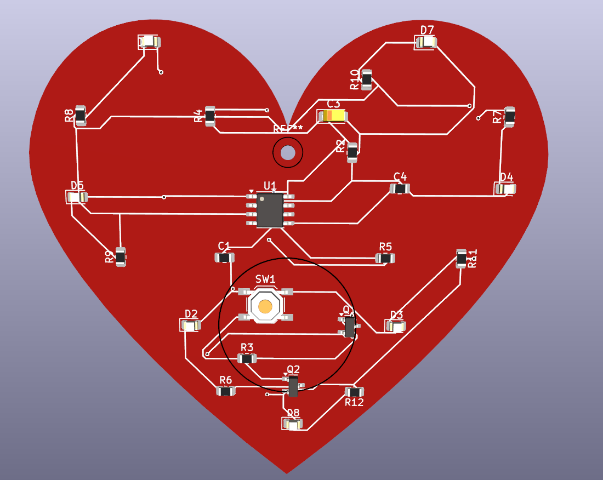
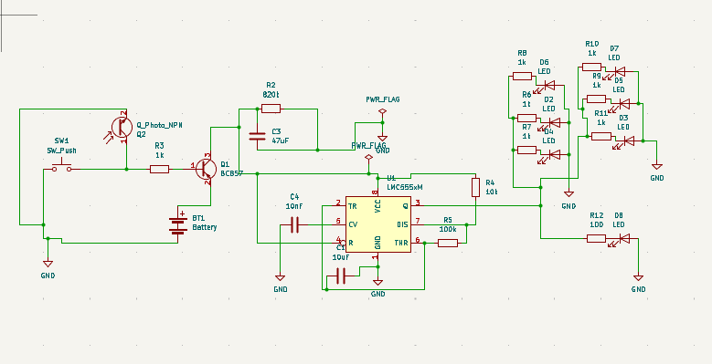

# Heart-Shaped LED PCB Design 

## Overview
This project features a custom heart-shaped PCB designed using **KiCad 9.0**. The goal was to combine electrical functionality with a unique form factor, suitable for decorative electronics or gift projects. 

## Visuals

*Figure 1: 3D Render of the heart-shaped board.*

*Figure 2: Complete circuit schematic.*

## Technical Details
* **CAD Tool:** KiCad 9.0
* **Shape:** Custom Heart Outline (Calculated using mathematical curves/coordinates).
* **Trace Design:** Curved traces to match the board's aesthetic.

## Components List
* **Light Emitting Diodes (LEDs):** 20x Red or Pink (SMD 0805 Package) arranged in a heart contour.
* **Power Source:** 3V CR2032 Coin Cell Battery (Düğme Pil).
* **Safety Feature:** Integrated PTC Fuse for overcurrent protection.
* **Control:** Mini Slide Switch (SPDT) for ON/OFF functionality.
* **Resistors:** 120Ω or 220Ω (SMD 0805) current-limiting resistors for LED longevity.
* **PCB:** Custom FR-4 substrate with a thickness of 1.6mm.
